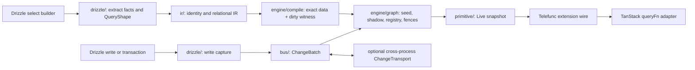

# `@telefunc/drizzle-experimental`

Experimental reactive Drizzle queries for Telefunc. The package turns a Drizzle `select()` into a `Live<T>`
snapshot, derives invalidation from captured writes, and uses ordinary Telefunc serialization plus an optional
TanStack Query adapter to make stale data refetch.

This document is a maintainer's map. Detailed correctness arguments stay beside the code that enforces them.

## Public surface

The package root exports:

- `reactiveDrizzle(db)`, which preserves ordinary Drizzle reads and writes and adds the terminal `.live()` to
  chains that start at that db's `select()`;
- `Live<T>`, whose public surface is only `readonly data: T`; and
- `derived(() => value)`, which composes a `Live` from other `Live` values read synchronously by the callback.

The `./tanstack-query` subpath exports `live(telefunction, ...args)`. It is a query-function adapter, not a
framework hook: it unwraps the returned `Live`, observes its stale signal, and invalidates the owning
`QueryClient` entry so TanStack refetches.

## Concepts to hold while reading

1. **A `Live` is a snapshot with a stale signal.** Its `.data` does not mutate in place; adapters refetch and
   replace the handle.
2. **Drizzle is a source adapter, not the engine's vocabulary.** The edge reads builder and database facts into
   source-neutral IR, graph inputs, and change batches.
3. **Precision is earned.** Exact row deltas use the data path. Unprovable but relevant changes use a dirty
   witness. Shapes or events that cannot be represented safely become coarse invalidations.
4. **Identity is semantic.** Relation identity routes writes to reads; instance identity additionally includes
   SQL shape, bindings, schema, dialect, and proven session authority so incompatible reads do not share state.
5. **State has an owner and a fence.** The registry owns graph identity and references; the live graph owns
   readiness and invalidation sequence; the subscriber fence closes the read-to-activation window.
6. **One committed transaction is one graph tick.** ORM writes are captured precisely where possible, buffered
   across transactions, discarded on rollback, and emitted only after the outer commit.
7. **The change bus is independent of Drizzle.** It routes local batches, encodes remote envelopes, handles
   per-origin sequence evidence, and owns subscription readiness and lifetime.
8. **The wire and cache adapters are downstream consumers.** The primitive activates only when serialized;
   Telefunc carries the handle; TanStack turns invalidation into a refetch.

## Stable core and brittle edge

The dependency direction is intentional:

| Layer | Owns | Stability rule |
| --- | --- | --- |
| `ir/` | Relational shapes, relation identity, predicate algebra, evaluation, and canonical encoding. | No Drizzle runtime import. Source-neutral values only. |
| `engine/` | Query classification, exact/dirty compilation, hydration protocol, graph variants, registry, and subscriber fence. | Consumes IR and injected contracts; never reads a Drizzle object. |
| `bus/` | Change batches, local routing, codec, per-origin ordering, transport resolution, and db-scoped runtime. | Accepts source-neutral changes. `captureReport.ts` stays here beside the core and needs no edge exemption. |
| `primitive/` | `Live`/`LiveCell`, derivation, taps, and Telefunc wire replacer/reviver. | Independent of the relational source. Browser-side modules remain server-free. |
| `tanstack-query/` | The optional query-function consumer. | Imports the browser-safe primitive contract, never the server graph or Drizzle edge. |
| `drizzle/` | Every private shape read and every source-specific execution decision. | May adapt into the core; the core must never import back into this directory. |

`engine/compile/importGraph.spec.ts` parses static, re-export, and dynamic imports across the core. It fails on a
computed dynamic import, rejects unapproved bare runtime dependencies, and rejects any path from the core into
`drizzle/`. This is an architectural gate, not a convention.

### Why each Drizzle module is quarantined

| Module(s) | Why the code belongs at the brittle edge |
| --- | --- |
| `binding/database.ts` | Reads Drizzle entity kinds, driver shape, live session authority, RLS catalog state, and executes dialect-specific SQL. |
| `binding/drizzleShape.ts` | Reads guarded private select-builder fields pinned to the supported Drizzle release. |
| `binding/hydrationExecutor.ts` | Reconstructs seed SQL from opaque Drizzle `SQL` handles and runs it on the bound database. |
| `extract/columns.ts` | Reads private table/column symbols, primary keys, schemas, and RLS metadata from Drizzle declarations. |
| `extract/identity.ts` | Resolves Drizzle placeholders and rendered SQL into the engine's instance key. |
| `extract/predicate.ts` | Converts Drizzle `SQL.queryChunks` into predicate IR and records unreadable leaves as unknown. |
| `extract/queryShape.ts` | Converts the guarded select config into `QueryShape` and cross-checks it against rendered SQL. |
| `extract/sqlChunks.ts` | Tokenizes Drizzle's private SQL-chunk vocabulary, including columns, params, placeholders, and nested SQL. |
| `reactiveDrizzle.ts` and `reactiveDrizzle.types.ts` | Proxy the db and thread `.live()` through Drizzle's runtime builders and higher-kinded select types. |
| `readCapture.ts` | Joins a Drizzle builder, live database facts, hydration, graph acquisition, the initial row read, and primitive activation. |
| `writeTerminals.ts` | Classifies Drizzle builder, driver, prepared, and raw execution surfaces so no terminal bypasses capture. |
| `writePlan.ts` | Reads write-builder config and chooses the fail-closed capture strategy for the dialect and returned-row shape. |
| `imageLayout.ts` | Owns PostgreSQL's `RETURNING old.*, new.*` layout and its Drizzle column decoders. |
| `writeCapabilities.ts` | Probes the executing PostgreSQL-compatible connection for the old/new-returning capability. |
| `writeSubstitution.ts` | Temporarily rewrites Drizzle `RETURNING`, taps its private mapper, and brackets refusal with savepoints. |
| `writeCapture.ts` | Intercepts Drizzle terminals, runs the chosen strategy, restores caller behavior, and emits the captured result. |
| `writeChanges.ts` | Validates Drizzle-returned rows and translates field names into physical-column `TableChange` values. |
| `writeProxy.ts` | Gives Drizzle transactions, nested savepoints, raw SQL, commit, and rollback their capture semantics. |
| `causeChain.ts` | Walks Drizzle-wrapped driver errors so the edge can classify SQLSTATE and permission failures. |

## Relational source seam

The engine has no source plugin registry and does not need a second adapter to justify one. The Drizzle edge
already meets five explicit contracts:

| Contract | Stable side | Drizzle side |
| --- | --- | --- |
| `QueryShape` | `ir/types.ts` describes relations, predicates, joins, grouping, windows, and set operations. | `drizzle/extract/queryShape.ts` reads a builder into that IR. |
| Instance key | The registry shares state only for an identical `instanceKey`. | `drizzle/extract/identity.ts` combines parameterized SQL, typed bindings, schema fingerprint, dialect, and semantic environment. |
| `HydrationExecutor` | `engine/graph/hydrate.ts` asks only for `scan(descriptor)`. | `drizzle/binding/hydrationExecutor.ts` turns the descriptor into a Drizzle query against the bound database. |
| Source facts | The core receives dialect, session provability, RLS status, schema identity, and relation identity as inputs. | Binding and extraction prove those facts from live Drizzle objects or report them conservatively. |
| `ChangeBatch -> ingest` | `bus/router` routes source-neutral table changes into registered graphs. | Write capture emits `ChangeBatch`; `bus/dbRuntime.ts` feeds it locally and `bus/changeRuntime.ts` publishes it remotely. |

## Honest limits

- The package ships no PostgreSQL CDC, durable outbox, watermark, or recovery log. It captures writes that pass
  through the wrapped Drizzle surface.
- Remote fan-out is best-effort after the database commit. A transport failure is reported but cannot fail or
  roll back the committed write; a remote live view can remain stale until a later explicit refetch.
- There is no exactly-once or global-order guarantee. A custom transport instead owes verbatim, at-least-once,
  no-backlog delivery; the runtime drops duplicates and coarsens when sequence evidence shows a gap or reorder.
- The default `ChangeTransport` is process-local. Multi-process deployments must inject a shared transport and a
  stable `changeNamespace`; no cross-process service is silently provided.
- The public API exposes no manual `Live` producer or invalidation-key system, and no framework-specific hook
  package. The TanStack integration is a query-function adapter.
- A live handle that is created but never serialized is reclaimed through `FinalizationRegistry`. Collection has
  no deadline, so its graph reference can survive until a later garbage-collection cycle.
- Drizzle private-shape support is deliberately pinned to `drizzle-orm@1.0.0-rc.4`. Shape drift fails toward
  coarse invalidation, but widening the peer range requires new fixture evidence.
- Supported databases are PostgreSQL, PGlite, and SQLite. MySQL is rejected at setup because this package has no
  verified row-capture lane for it.
- Only chains beginning at the wrapped db's own `select()` gain `.live()`. A CTE-prefixed
  `db.with(cte).select()` remains an ordinary Drizzle read.
- A physical relation declared once with a schema and once without one has two routing identities. The router
  warns when it observes this split, but it cannot safely guess that they name the same table.

## Glossary

| Term | Meaning here |
| --- | --- |
| **Live** | A snapshot value with an internal stale signal; public code reads `.data`. |
| **QueryShape** | The source-neutral relational IR extracted from a select builder. |
| **Relation identity** | The injective, optionally schema-qualified key shared by read routing and write events. |
| **Instance key** | The identity of one graph state: plan, values, schema, dialect, and semantic authority. |
| **GraphPlan** | The compiler's recipe for constructing a coarse, stateless, or stateful graph. |
| **Coarse graph** | A graph that watches relation identities and invalidates without applying row images. |
| **Stateless graph** | A per-change evaluator that keeps no historical rows and therefore never reseeds. |
| **Stateful graph** | A seeded incremental dataflow with row history for joins, aggregates, windows, and retractions. |
| **Seed** | The async baseline scan followed by one muted synchronous installation into graph state. |
| **Shadow** | A primary-key index of the pruned rows retained to resolve key-only retractions. |
| **Dirty witness** | A sound over-approximation that invalidates when exact membership cannot be decided. |
| **ChangeBatch** | The atomic set of table changes routed as one graph tick. |
| **Subscriber fence** | The sequence check that replays a change landing between the initial read and activation. |
| **Token / lease** | Registry references before and after serialize-time activation; both keep shared graph state alive. |
| **Change transport** | The dedicated pub/sub seam carrying encoded, namespaced change envelopes between runtimes. |
