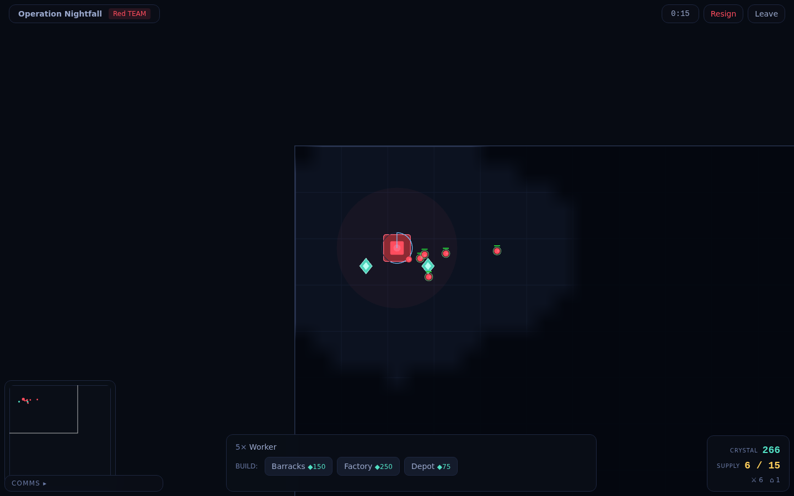

# Telefront — a server-authoritative RTS stress test of `Room`

A real, playable **10v10 real-time strategy game** built on [telefunc](https://telefunc.com)'s new
`Room` primitive ([#436](https://github.com/telefunc/telefunc/pull/436)), written to find where a
*server-authoritative real-time game* fights the API — a deliberately different shape of stress test
from the [Discord clone](https://github.com/telefunc/telefunc/pull/445).

Where the Discord clone is **broadcast-and-presence** (chat, DMs, A/V — the room *is* the app), an
RTS is **authority-and-simulation**: one server owns the truth, ticks it 10×/second, and streams a
compact, fog-of-war-filtered **binary** world to each team, while every player streams orders back.
That profile leans on the parts of `Room` the chat app never touched — the binary lane as an
*app-authored* delta protocol, a server that must *broadcast* and *receive*, per-audience interest
management, and a per-room simulation loop — and that is exactly where the new findings are.

Every place the Room API forced complexity into app code is flagged inline (search for `FINDING`)
and collected in [Findings](#findings--room-pr-436-pain-points-a-server-authoritative-game-hits).




## The game (it's real)

- **Lobby → battle → result**, all in one `Room` per match (phase lives in room meta).
- **Economy**: workers harvest crystal → return to HQ → a shared team pool; spend it on units/buildings.
- **Build & produce**: Workers construct **Barracks / Factory / Depot**; buildings produce
  **Workers / Soldiers / Tanks**; supply caps from HQ + Depots.
- **Combat**: HP, range, cooldowns, auto-acquire; ranged tracers + explosions; destroy all of a
  team's buildings (or make them resign) to win.
- **Fog of war**: team-shared vision; you only ever receive enemies your team can see.
- **RTS controls**: box + click selection, contextual right-click orders (move / attack / gather /
  rally), build placement with a validity ghost, attack-move, stop, edge-scroll + arrow-key + minimap
  camera, zoom.
- **Reconnect**: reload mid-battle and your army is exactly where you left it (identity-keyed).

**Stack**: Vike + vike-react (CSR) · telefunc (remote functions + rooms) · **PixiJS v8** (WebGL
renderer) · Zustand · Tailwind v4 · Hono. No database — an RTS match is ephemeral, so the durable
truth is the **authoritative in-memory simulation** the server owns (`server/sim/`), and rooms are
the live layer on top.

## Running it

```bash
pnpm install && pnpm build   # repo root (workspace `telefunc` is linked)
cd test/rts-game
pnpm dev                     # http://localhost:3000
```

Pick a commander name, **Create a battle**, then open a second browser profile (or incognito),
sign in as someone else, and **Join**. Put one commander on each team, ready up, and **Launch**.

## Architecture

The server is the **only** simulator. Clients render interpolated snapshots and send orders; they
never simulate. That removes any lockstep/determinism burden — the server is truth — and puts all
the weight on `Room`'s delivery lanes.

| Concern | How it maps onto `Room` |
|---|---|
| A match | One room `rts:match:<id>`, sized 20 (10v10 — the hidden authority isn't counted). Phase (`lobby`/`playing`/`ended`) + winner live in room meta, read live by the browser list and joined players. |
| Identity & reconnect | `join(meta, { identity: userId })`, server-stamped. Units are owned by team; the trusted `identity→team` map is snapshotted at match start (client `meta.team` is display-only). A reload rejoins the same identity → same army. |
| Lobby presence | `room.snapshot({ by: 'identity' })` + `onChange` — the `useSyncExternalStore` contract, tabs collapsed per player. |
| Team pick / ready | client `me.setAttributes({ team })` / `{ ready }`. |
| Match browser | `Room.list<MatchMeta>({ prefix })`, **polled** (no live directory event). |
| **State broadcast** | The server runs on the room's **hidden authority** (`join({ hidden: true })`, seated up front) and `publishBinary`es a per-team, fog-filtered, delta-compressed frame on a **named track** (`state:red` / `state:blue` / `state:full`) every tick, marking keyframes `{ retain: true }` so a late subscriber is seeded automatically. Clients `subscribeBinary({ track })` on the authority to just their team's. |
| **Commands** | `me.send(authority.id, cmd)` → the authority's `listen()`; `send()` resolves with a receipt. The client gets the authority handle from `onEnterMatch` (no `room.server`). |
| Chat | room-wide `publish`/`subscribe` (all-chat). |
| System banners | `Room.announce()` (match-end). |
| Capacity | `Room.guard(room, { onBeforeJoin })` (`count` excludes the hidden authority). |
| Kick / close | `Room.removeParticipant` / `Room.close` (match teardown, driven by `onEmpty` — the hidden authority doesn't keep the room busy). |

**Module map** — `shared/` (game constants + the binary wire protocol + typed `Room` aliases) ·
`server/sim/` (the authoritative `World`, the per-tick fog + delta snapshot builder, the command
validator, and the `Match` that holds the room's hidden authority + tick loop) · `server/` (identity, the
match registry, guards) · `telefunc/` (lobby + match API) · `app/net.ts` (the client's stream +
command lanes) · `app/engine/` (PixiJS renderer, camera, input, fog, minimap, interpolation) ·
`app/ui/` (React + the Zustand Room→React adapter).

## Testing

`.test-dev.test.ts` / `.test-preview.test.ts` drive **two real commanders** (separate browser
contexts) through the whole stack — sign-in, lobby presence, all-chat, team pick, launch, the live
binary state stream (units + a running economy on both clients), a command round-trip (produce a
unit and watch the count rise), and a deterministic resign → victory/defeat. WebGL runs on headless
Chromium's SwiftShader.

```bash
pnpm exec test-e2e test/rts-game/.test-dev.test.ts   # repo root
```

---

# Findings — Room PR #436 pain points a server-authoritative game hits

Ordered by how much app complexity each caused. "Receipt" = where the app pays for it. Findings
that **echo or extend** a Discord-clone finding are marked; the rest are new to this shape of app.

The throughline: **`Room` models a party of peers the server *moderates*, not an authority the
server *is*.** A server-authoritative game needs the server to be a first-class actor — to broadcast
binary, to receive private input, to own a loop and per-audience views — and (in round 1) `Room`
had no seat for it, so the app seated the server as a synthetic "participant" and hand-rolled the
rest.

## Round 2 — the triage, adopted (`51b4613` → `46ab8ae`)

Round 1 audited against `cea87ef`. The author triaged all 12 findings, landed the accepted ones in
`51b4613`, and then — as this app migrated onto them and kept reporting — **built two more**:
`da1b9f7` generalized the round-2 server seat into **hidden participants** (`join({ hidden: true })`,
any number, read with `getParticipants({ hidden: true })`, no more singular `room.server`), and
`90dcb4a` built **`{ retain: true }`** — MQTT-style keyframe-on-subscribe, the exact fix finding #5
asked for. This app tracks the base (now `46ab8ae`) and **deletes the workaround each time** — the
point of the exercise. Verdicts and receipts:

| # | Finding | Verdict | What the adoption deleted / resolved |
|---|---|---|---|
| **1+2** | server binary broadcast · client→server lane | **✔ hidden authority** — `join({ hidden: true })` (the `51b4613` server seat, generalized in `da1b9f7`), handed to the client by `onEnterMatch` | the synthetic "authority" participant, its `meta.authority` flag, the anti-spoof guard (`server/guards.ts`), the hand-rolled teardown count — **and now `room.server` itself**: the client holds the authority returned from the join telefunction, so there's no accessor and no roster scan at all |
| **5** | keyframe-on-subscribe | **✔ `{ retain: true }`** (`90dcb4a`) — was DOCS, now built | the `onDemand`-force-keyframe seam on the team tracks (`server/sim/match.ts`): the server retains the last keyframe and replays it to each new subscriber, so one joiner no longer re-broadcasts a keyframe to the whole track. `onDemand` stays only for the on-demand spectator track (see below) |
| **2b** | `send()` returned void | **✔** `send(): Promise<RoomSendReceipt>` | commands are now acked (`app/net.ts`); kept fire-and-forget since orders are idempotent |
| **9** | identity-view types unexported | **✔** exported from the barrels | the structural type derivation in `rosterFromSnapshot` (`app/store.ts`) — now names `RoomIdentitySnapshotView` |
| **10a** | `RoomInfo.meta` untyped | **✔** `Room.list<M>()` | the `as MatchMeta` cast in `listMatches` (`server/matches.ts`) |
| **4** | 1-bit framing | **DOCS** (I overstated it) | the subscriber's `info` already carries `seq`+`timestamp`; the in-band `tick` is game-semantic |
| **7** | sim-loop lifecycle | **DOCS / by-design** | multi-node needs leader election; the `globalThis` singleton + the hidden authority's `onEmpty` are idiomatic |
| **11** | client meta re-derived | **DOCS** | trust callout beside "identity is trusted" |
| **3** | binary DM | **REJECT** | no workload — per-(member,track) keys already deliver identity-scoped binary; fog is per-team tracks |
| **6** | per-subscriber filter | **REJECT** | would force a per-subscriber re-encode → destroys "bytes never leave the source"; per-player fog is honestly N tracks |
| **8** | audience-scoped publish | **REJECT** | `Room.send({ identity })` fan-out or a per-team room — both shipped |
| **10b** | live `watchList` | **REJECT** | the #445 lobby-room + announce directory pattern covers it; this app polls for simplicity |
| **12** | latest-only binary | **DEFER #449** | can't evict the transport send-buffer → false promise on a reliable lane; the datagram lane is the honest fix |

**One residual, surfaced by the adoption (`server/sim/match.ts`).** `{ retain: true }` fully seeds a
late subscriber for an **always-on** track (the two team fog streams broadcast every tick, so a
retained keyframe always exists). It can't seed the **on-demand** spectator `full` track: that track
is published only while someone watches it, so a fresh watcher may find *no* retained frame (or a
stale one from a prior spectator). So the app keeps `onDemand` for that one track — force a fresh
keyframe when its subscriber count rises — and uses pure retention for the team tracks. Not a defect;
the honest boundary of a retained-message model is "there must be a last message to retain."

The finding write-ups below are the round-1 audit, each now tagged with its verdict; the inline
`grep FINDING` call-outs in the code reflect the adopted state.

## 1. No server-authored **binary** broadcast — the server has to impersonate a player

> _Verdict: ✔ **Adopted** — the hidden authority (`join({ hidden: true })`, `51b4613` + `da1b9f7`), handed to the client by `onEnterMatch`; no `room.server`, no roster scan._

`Room.announce()` is the room-authored broadcast, but it is **text/JSON only** — there is no
`Room.announceBinary()`. A server-authoritative game's entire output is a compact binary state
frame (§4), so to emit it the server must **`join()` its own room as a participant** and call
`participant.publishBinary()`. That one workaround is load-bearing for the whole app.

Consequences that ripple out:

- The synthetic **"authority" member leaks into presence**: it shows up in `getParticipants()`,
  `snapshot()`, and `count`, so every consumer filters it by a `meta.authority` flag
  (`app/store.ts` roster, `server/matches.ts` real-player count) and the room is sized `21` for
  "10v10 + 1 server".
- The flag itself needs **anti-spoof guarding** so a client can't hide from every roster by faking
  it — allowed only for the server-stamped `authority:` identity (`server/guards.ts`).

Receipt: `server/sim/match.ts` (`this.room.join({ authority: true }, { selfDelivery: false })` just
to reach `publishBinary`). **Fix shape**: a room-authored binary broadcast (`Room.announceBinary(id,
bytes, { track, keyFrame })`), or a blessed "server participant" that isn't a roster member.

## 2. No first-class client→server lane — commands ride `send` against its contract

> _Verdict: ✔ **Adopted** — the hidden authority’s inbox + `authority.id` (returned by `onEnterMatch`); `send()` receipt (2b), `51b4613`._

The server is not a participant with an inbox. The only server-side receive points are **guards**
(policy hooks) and a server-side **`subscribe()`** (which sees room-wide broadcasts, not private,
per-player input). A server-authoritative game needs a **private, low-latency, per-player** command
lane to the authority — dozens of orders/second across 20 players, never visible to opponents.

The only fit is `me.send(authorityId, cmd)` into the authority's `listen()` (`app/net.ts` →
`server/sim/match.ts`). It works — it's the same shape as the Discord bot receiving DMs — but the
API is fighting it the whole way:

- **`send` is documented as at-most-once peer signaling** — *"delivered to a live participant at
  most once, never retried or stored"* — yet orders must arrive reliably and in order. We lean on
  the live WebSocket underneath being ordered + reliable (it is), but the contract promises none of
  it, and there is **no ack, no sequence number, no backpressure**. We harden by making every order
  **absolute** (goto/attack *this id*) so a dropped one is simply re-issuable — app work to paper
  over a lane not meant for this.
- **`send` is text-only** (§3), so a compact binary order batch isn't possible.
- You address the authority by a **magic participant id discovered from the roster** (`meta.authority`)
  — there is no "the host / the server" handle.

**Fix shape**: a real client→server room lane — e.g. `room.toServer(data)` delivered to a
server-registered handler, reliable and ordered, with a binary form. This is the single biggest gap
for authoritative games.

## 3. `send` / `Room.send` are text-only — no binary private delivery

> _Verdict: **Rejected** — no workload; per-(member,track) keys already deliver identity-scoped binary._

Neither the member-to-member `me.send()` nor the room-authored `Room.send()` accepts binary. This
closes off two natural designs at once: **per-player** fog-filtered binary snapshots (you'd want to
`Room.send(room, { identity }, frameBytes)`), and **binary command batches** (§2). We sidestep it by
making fog **per-team** rather than per-player, so state fits on 2 shared named tracks (§6) instead
of N identity-addressed binary sends. Receipt: the entire per-team-track design in
`server/sim/snapshot.ts`. **Fix shape**: a binary variant of `send` (and identity-addressed send).

## 4. The binary lane gives one bit of framing — the whole delta protocol is in-band

> _Verdict: **Docs** — I overstated it: the subscriber’s `info` already carries `seq`+`timestamp`._

`BinaryFrameInfo` is exactly `{ track, keyFrame }`. That is all the per-frame structure a real
delta-compressed state protocol gets from the API. The `keyFrame` bit maps cleanly onto "full
snapshot vs delta", but there is nowhere for an app-defined header — a **tick number**, a **baseline
id** for delta reconciliation, a protocol **version** — so all of it is hand-packed into the payload
bytes (`shared/protocol.ts`, a 20-byte header ahead of the entity/removed/event sections). Not
fatal, but every binary app re-invents the same envelope. **Fix shape**: an app-defined per-frame
metadata blob alongside `{ track, keyFrame }`, or a small typed header.

## 5. No keyframe-on-subscribe / binary replay — the binary twin of `tail` (extends Discord #22)

> _Verdict: ✔ **Built** — `{ retain: true }` (`90dcb4a`), the MQTT-style keyframe-on-subscribe this asked for. Was DOCS in `51b4613`; the author then built it._

Channels got a lossless "history then live" fence (`Room.get({ tail })`). In round 1 the **binary
state lane had no equivalent**: a client that subscribed mid-stream — a fresh joiner, a reconnect, a
backgrounded tab — received deltas it couldn't apply, and there was **no "send me the current state
on subscribe"**. Round 1 hand-rolled the seam off `onDemand` count *changes* (coarse — a count, not
an event you can answer with a payload), which also meant one late joiner forced a **full
re-broadcast to the entire track audience**.

**`90dcb4a` built the fix as `publishBinary(frame, { keyFrame: true, retain: true })`:** the server
keeps the last retained frame per `(publisher, track)` and replays it to every new subscriber
*before* any live frame — MQTT retained-message semantics, dropped when the publisher leaves or the
room closes. The app now marks its team-track keyframes `{ retain: true }` (`server/sim/match.ts`)
and the whole `onDemand`-force-keyframe seam on those tracks is gone. It's **strictly better** than
the round-1 workaround: only the joiner pays (its own retained-frame replay), so a reconnect no
longer re-keyframes the other nine subscribers on the team track. The one client-side remnant — the
`seeded` gate in `app/engine/world-buffer.ts` — stays as a cheap safety net (ignore frames until the
first keyframe), now defending only against a delta racing ahead of the retained replay.

Residual (see the triage note): retention needs a last message to retain, so the **on-demand**
spectator `full` track — published only while watched — still leans on `onDemand` to force the first
watcher's keyframe. Pure retention covers the always-on team tracks; `onDemand` covers the cold one.

## 6. Interest management is per-(publisher, track), not spatial/per-subscriber

> _Verdict: **Rejected** — a per-subscriber filter would destroy source-selectivity; per-player fog = N tracks._

`subscribeBinary({ track })` selectivity is real and enforced at the source (unwanted tracks never
leave the publisher) — it's what makes "2 teams = 2 fog streams" clean and cheap: the server
pre-computes `state:red` and `state:blue`, and a red client's socket never carries blue's vision.
But it is selectivity **by named track**, not **by subscriber**. Real fog is per-*viewer* (or, in
FFA, per-player); mapping that onto tracks means **one pre-computed track + one encode per distinct
audience**. Two teams is fine; per-player vision (or 8-way FFA) would be N tracks and N encodes with
no primitive to share the work. Receipt: `server/sim/snapshot.ts` builds and diffs one baseline per
track. **Fix shape**: a server-side per-subscriber filter hook on a broadcast stream (given the
subscriber, return the bytes they should get), so interest management can be content/space-based, not
just track-name-based.

## 7. A per-room simulation loop has no lifecycle home (extends Discord #13)

> _Verdict: **Docs / by-design** — multi-node needs leader election; `globalThis` singleton + the hidden authority’s `onEmpty` are idiomatic._

The Room API is request-driven (telefunctions) and event-driven (guards/hooks). There is no **room
lifecycle** — no "created / first participant / went idle / gone" — to hang a match's authoritative
object and its 10 Hz `setInterval` on. So the app keeps a **`globalThis` registry** of live `Match`
instances, starts/stops the loop by hand (on start; on win; on a 30s all-players-gone grace), and
pins the registry on `globalThis` because Vite runs two SSR module graphs and reloads them in dev.
The Discord clone hit the mild version (a bot + a DB handle behind a boot latch); an RTS hits the
sharp version — a **real-time loop** whose duplication on a hot-reload would double-simulate.
Receipt: `server/matches.ts`. **Fix shape**: room lifecycle hooks (`onRoomActive`/`onRoomIdle`) or a
blessed place to own per-room server state with the room's lifetime.

## 8. No audience-scoped publish — team-only messaging leaks

> _Verdict: **Rejected** — `Room.send({ identity })` fan-out or a per-team room; both shipped._

`publish()` reaches every room subscriber, so there is no room-native **team chat** or team-only
signal — it would be delivered to opponents' clients (hiding it client-side is a non-answer:
anti-cheat). We ship **all-chat** only. The general shape recurs in games (team pings, alliance
whispers). Receipt: `app/ui/Chat.tsx`, `shared/types.ts`. **Fix shape**: a scoped publish
(`publish(data, { to: identities })`) or first-class subgroups within a room. (Related to Discord
#22's "unscoped broadcast".)

## 9. `RoomIdentitySnapshotView` / `IdentityGroupView` aren't exported (fresh instance of Discord #16)

> _Verdict: ✔ **Adopted** — the identity-view types are exported from the barrels, `51b4613`._

The lobby roster uses `room.snapshot({ by: 'identity' })` to collapse a player's tabs to one row —
but its return types (`RoomIdentitySnapshotView`, `IdentityGroupView`) are **not re-exported** from
`telefunc` or `telefunc/client` (verified against the built barrels), even though the sibling
`RoomSnapshotView` / `ParticipantSnapshotView` are. So the app can't name what `snapshot({ by:
'identity' })` returns and reads it structurally. Same class of gap Discord #16 closed for the
`snapshot()`/`onLeave` types — reopened for the Tranche-2 identity-snapshot family. Receipt:
`app/store.ts` `rosterFromSnapshot`. **Fix shape**: add both to the public barrels.

## 10. `Room.list` is a point-in-time directory with untyped meta (extends Discord #4)

> _Verdict: ✔ **Adopted (10a)** `Room.list<M>()` · **Rejected (10b)** live `watchList` (lobby-room + announce covers it)._

The match browser needs "what battles are open right now". `Room.list({ prefix })` answers it, but
there is **no live directory event** ("a room opened / filled / closed"), so the browser **polls**
every 1.6s (`app/store.ts`), and `RoomInfo.meta` is untyped (`RoomMeta`), so reading `phase`/`name`
needs a cast (`server/matches.ts`). Fine at this scale; a lobby of hundreds of matches would feel
the poll. **Fix shape**: a `Room.watchList({ prefix })` subscription, and `RoomInfo` carrying the
room's meta generic.

## 11. Client-authored meta means security-relevant fields must be re-derived server-side (sharp-edge note)

> _Verdict: **Docs** — trust callout beside “identity is trusted”._

Not a defect — the intended model is "metadata is display state, `identity` is trusted" — but an RTS
makes the edge concrete and worth a docs callout. **Team** is chosen in the lobby via client
`setAttributes({ team })`, so it *cannot* be trusted for command authorization (a client could set
`team` to the enemy's and drive their army). The app therefore **snapshots the authoritative
`identity→team` map server-side at match start** and never trusts `meta.team` again — command
validation checks that map, not the payload or the participant's meta (`server/matches.ts`,
`server/sim/commands.ts`). Anyone building competitive multiplayer on `Room` will need this pattern;
it belongs in the guides next to "identity is trusted".

## 12. Reliable-ordered delivery has no lossy/latest-only mode for high-frequency state

> _Verdict: **Deferred to #449** — latest-only is a false promise on a reliable lane; the datagram lane is the honest fix._

The docs already scope this for A/V (the `Room` transport is reliable + ordered; large live video
wants an unreliable datagram lane, [#449](https://github.com/telefunc/telefunc/issues/449)). A
high-frequency **binary state** broadcast wants the same escape hatch for a *different* reason: a
slow or backgrounded client accumulates a **state-frame backlog** (head-of-line blocking) when the
only useful frame is the newest. `publish({ coalesce })` gives text this "latest-only" collapse, but
**`publishBinary` has no `coalesce`** and no per-track "drop stale, keep newest" mode. We tick at a
modest 10 Hz and keep frames small to stay under it; a 30–60 Hz shooter would hit it hard. **Fix
shape**: `coalesce`/latest-only for `publishBinary`, or the datagram lane of #449 applied to state.

## Room API coverage

| API | Used | Where / why not |
|---|---|---|
| `Room.create` / `get` / `getOrCreate` / `list` / `close` / `guard` / `setAttributes` / `announce` / `removeParticipant` | ✔ | `server/matches.ts`, `server/sim/match.ts`, `server/guards.ts` — `list` is the polled match browser (§10), `setAttributes`/`announce` drive phase + result |
| `Room.get({ tail })` | ✖ | history is a DB/replay concept; an RTS match is ephemeral and has no text history to fence — but the **binary** analog is exactly what's missing (§5) |
| `Room.send(room, { identity }, …)` | ✖ | text-only (§3); state is per-team binary tracks, not identity-addressed sends |
| `room.join({ identity, hidden })` / `getParticipants({ hidden })` | ✔ | identity-stamped joins; the **hidden authority** (`join({ hidden: true })`) runs the sim, read off-presence and handed to the client by `onEnterMatch` — no `room.server` accessor (`telefunc/match.telefunc.ts`, `app/store.ts`) |
| `room.snapshot()` / `snapshot({ by: 'identity' })` / `onChange` | ✔ | the Room→React lobby adapter; identity-grouped roster, named types (§9 adopted) |
| `room.subscribe` / `publish` (typed `Pub`) | ✔ | all-chat (§8); `Room<MatchMeta, PlayerMeta, ChatMsg>` |
| `authority.publishBinary({ track, keyFrame, retain })` + ack `receivers` | ✔ | **the core** — per-team fog-filtered delta frames from the hidden authority; keyframes `{ retain: true }` seed late subscribers (§1, §4, §5) |
| `member.subscribeBinary({ track })` | ✔ | each client takes only its team's fog track; the retained keyframe arrives first (§5, §6) |
| `me.onDemand((track, count))` | ✔ | gate + force-keyframe for the **on-demand** spectator track only (§5); team tracks use retain, not `onDemand` |
| `me.send(authority.id)` (receipt) / `authority.listen` | ✔ | the client→server command lane into the hidden authority (§2 adopted) |
| `me.setAttributes` | ✔ | team pick + ready in the lobby |
| guards: `onBeforeJoin` | ✔ | capacity only now — the hidden authority needs no anti-spoof and bypasses the hook (`server/guards.ts`); per-instance (Discord #3) |
| `onAfter*` hooks / `LeaveCause` reasons / `onParticipantUpdate` | ✖ | no message persistence; leave/kick handling is coarse (back-to-home) — a longer game would use them |
| `publish({ coalesce })` | ✖ | chat is low-rate; the state lane wants `coalesce` but it's **binary-only-absent** (§12) |

## What went right

Plenty did, and it's worth recording: **named binary tracks + source-selective `subscribeBinary`**
are a genuinely good fit for team fog (fog is enforced upstream, so an opponent's vision never
touches your socket); **`{ retain: true }`** made keyframe-on-join a one-word change that seeds each
late subscriber without disturbing the rest of the track, and **`onDemand`** still cleanly pauses the
spectator stream when unwatched; the **hidden authority** (`join({ hidden: true })`) gave the server
a first-class, non-presence seat and, handed back from `onEnterMatch`, erased the `room.server`
roster dance entirely; **identity** made reconnect-to-your-army trivial; **`snapshot()` + `onChange`**
is the entire lobby adapter; and returning `{ room, me, authority }` from one telefunction with
reference-identity serialization means the client wires the whole match off three handles. The gaps
above are all about the server needing to be a *first-class actor*, and round after round the API has
grown to meet exactly that — the peer model was always solid.
